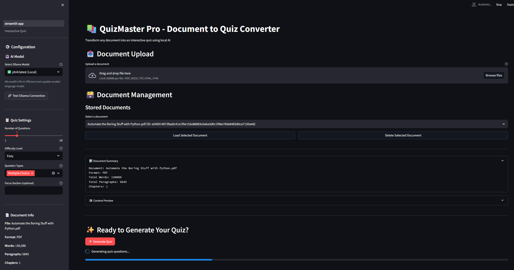
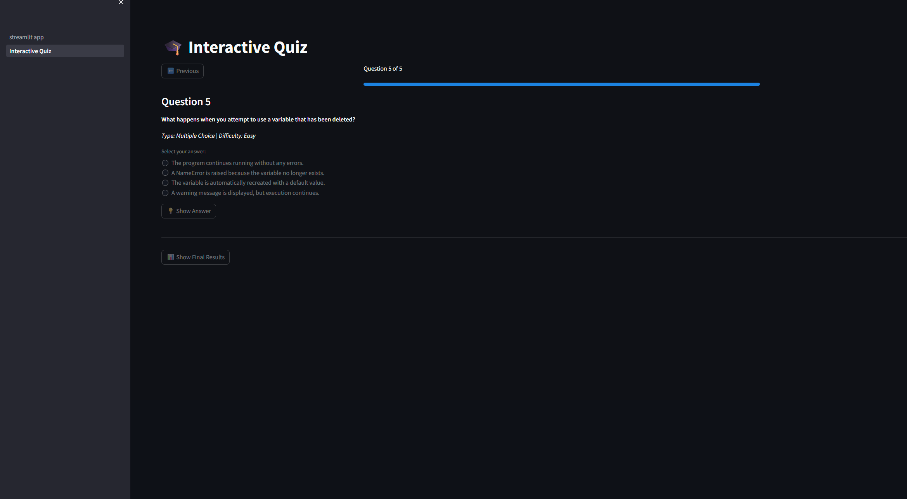

# 📚 QuizMaster Pro

Are you struggling to memorize concepts for an exam or do you simply want to improve in a professional topic? Then simply upload your document to QuizMaster Pro and let the AI create a custom quiz in order to test and monitor your learning. QuizMaster Pro leverages Ollama for private, offline quiz generation from PDF, DOCX, TXT, and HTML documents.

 

## 🌟 Features

### Document Processing
- **Multi-format Support**: PDF, DOCX, TXT, HTML files
- **Intelligent Segmentation**: Automatically identifies chapters, sections, and content structure
- **Metadata Extraction**: Extracts document structure and statistics
- **Content Preview**: Review processed content before quiz generation

### 🗃️ Document Management (New!)
- **Persistent Storage**: Documents are automatically stored using ChromaDB for future use.
- **Document Listing**: View all previously processed and stored documents.
- **Load Previous Documents**: Easily load any stored document to regenerate quizzes or review content.
- **Individual Deletion**: Delete documents from storage when no longer needed.
- **Metadata Preservation**: All original document metadata is retained with the stored content.

### AI-Powered Quiz Generation
- **Local LLM Integration**: Uses Ollama for private, offline processing
- **Enhanced Question Relevance**: Questions are generated from specific, relevant text segments, avoiding irrelevant introductory or summary content.
- **Conceptual Questioning**: Prompts are refined to encourage questions about concepts, principles, and implications, rather than direct textual recall.
- **Natural Question Phrasing**: Questions avoid phrases like "According to the text segment" for a more natural quiz experience.
- **Automatic Model Management**: Smart model detection and automatic downloading
- **Multiple Question Types**: 
  - Multiple Choice Questions (MCQ) with plausible distractors
  - Open-Ended Questions
  - True/False Statements
  - Fill-in-the-Blank Questions
- **Difficulty Levels**: Easy, Medium, Hard
- **Contextual Focus**: Generate questions from specific sections
- **Detailed Explanations**: Each answer includes comprehensive explanations with text references

### Interactive Quiz Experience
- **Modern UI**: Clean, responsive Streamlit interface
- **Question Navigation**: Move between questions with progress tracking
- **Immediate Feedback**: Instant answer validation and explanations
- **Results Summary**: Comprehensive quiz completion statistics
- **Session Management**: Maintains quiz state across interactions

### Smart Model Management
- **Automatic Model Detection**: Shows which models are locally available vs. need downloading
- **One-Click Model Setup**: Simply select any model - downloading happens automatically
- **Visual Status Indicators**: Clear icons show model availability status
- **Background Downloads**: Models download seamlessly with progress feedback
- **Zero Manual Setup**: No need to manually run `ollama pull` commands

### Privacy & Performance
- **100% Local Processing**: All data stays on your machine
- **Model Selection**: Choose from various Ollama models
- **Connection Testing**: Verify Ollama connectivity
- **Progress Indicators**: Real-time feedback during processing
- **Error Handling**: Graceful handling of processing failures

## 🚀 Quick Start

### Prerequisites
- Python 3.8 or higher
- [Ollama](https://ollama.ai/) installed and running
- At least one Ollama model downloaded
- **ChromaDB**: Automatically installed with dependencies, but ensures persistent document storage.

### Installation

1. **Clone the Repository**
   ```bash
   git clone <repository-url>
   cd QuizMaster
   ```

2. **Install Dependencies**
   ```bash
   pip install -r requirements.txt
   ```

3. **Install and Setup Ollama**
   ```bash
   # Install Ollama (visit https://ollama.ai/ for platform-specific instructions)
   
   # Optional: Download a model manually (or let QuizMaster do it automatically)
   ollama pull llama3.2:3b    # Not required - app will download automatically
   ```

4. **Start Ollama Server**
   ```bash
   ollama serve
   ```

5. **Launch QuizMaster Pro**
   ```bash
   streamlit run src/quizmaster/streamlit_app.py
   ```

6. **Open in Browser**
   Navigate to `http://localhost:8501`

## 📖 Usage Guide

### Step 1: Configure Settings
- **Smart Model Selection**: Choose from available Ollama models in the sidebar
  - ✅ Models marked as "(Local)" are already downloaded
  - 📥 Models marked as "(Pull needed)" will be automatically downloaded
- **Automatic Model Management**: Simply select any model - QuizMaster will handle the rest
- **Connection Testing**: Use "Test Ollama Connection" to verify setup
- Configure quiz settings:
  - Number of questions (1-20)
  - Difficulty level (Easy/Medium/Hard)
  - Question types to include
  - Optional focus section keywords

### Step 2: Upload & Process Document
- Click "Upload a document" and select your file.
- Supported formats: PDF, DOCX, TXT, HTML.
- Click "Process Document" to analyze the content.
- The document will be automatically stored in the local ChromaDB.
- Review the document summary and content preview.

### Step 3: Manage Stored Documents (New!)
- In the "Document Management" section, you can:
  - See a list of all previously processed and stored documents.
  - Select a document from the dropdown to load it back into the application.
  - Click "Load Selected Document" to prepare it for quiz generation or review.
  - Click "Delete Selected Document" to remove it from storage.

### Step 4: Generate Quiz
- Ensure a document is processed or loaded.
- Click "Generate Quiz" to create questions.
- Monitor the progress bar during generation.
- Review generation info (model used, content length).

### Step 4: Take the Quiz
- Navigate through questions using Previous/Next buttons
- Answer each question according to its type
- Click "Show Answer" to see explanations
- View final results at the end

## 🔧 Configuration

### Supported Ollama Models
- `llama3.2:3b` - Fast, lightweight (default)
- `llama3.1:8b` - Balanced performance and quality
- `llama3.1:70b` - Highest quality (requires significant resources)
- `mistral:7b` - Alternative option
- `gemma2:9b` - Google's model
- `qwen2.5:7b` - Alibaba's model

### Question Types
- **Multiple Choice**: 4 options with plausible distractors
- **Open-Ended**: Requires detailed written responses
- **True/False**: Binary choice questions
- **Fill-in-the-Blank**: Complete sentences with missing terms

### Difficulty Levels
- **Easy**: Basic facts and straightforward concepts
- **Medium**: Understanding and application of ideas
- **Hard**: Analysis, synthesis, and critical thinking

## 🏗️ Architecture

### Core Components
- **`streamlit_app.py`**: Main application interface and document management.
- **`document_processor.py`**: Handles document parsing, intelligent segmentation (now more granular and filtered), and metadata extraction.
- **`quiz_generator.py`**: LLM-powered question generation with refined prompts for conceptual and natural questions.
- **`chroma_manager.py`**: Manages persistent storage and retrieval of documents using ChromaDB.
- **`requirements.txt`**: Python dependencies.

### Data Flow
1. Document upload and validation.
2. Content extraction and intelligent segmentation (now sentence-level with irrelevant content filtering).
3. Metadata extraction and structured content creation.
4. **Document Storage**: Processed documents are automatically stored in ChromaDB.
5. **Document Retrieval**: Stored documents can be loaded from ChromaDB for reuse.
6. LLM prompt engineering and question generation (using specific segments and refined prompts).
7. Interactive quiz presentation and scoring.

### Privacy Design
- All processing occurs locally on your machine
- No data is sent to external services
- Documents and questions remain private
- Ollama models run offline

## 📋 Requirements Compliance

✅ **Document Processing**: Multi-format support with enhanced intelligent segmentation and irrelevant content filtering.  
✅ **Document Management**: Persistent storage, listing, loading, and deletion of documents via ChromaDB.  
✅ **Quiz Generation**: All question types with difficulty levels, now generating more conceptual and naturally phrased questions.  
✅ **Interactive Experience**: Full quiz interface with navigation.  
✅ **Local LLM Integration**: Complete Ollama integration with model selection.  
✅ **Performance**: Optimized for responsiveness with progress indicators.  
✅ **Reliability**: Comprehensive error handling and fallback mechanisms.  
✅ **Usability**: Intuitive interface with helpful guidance.  
✅ **Privacy**: 100% local processing for maximum data security.  
✅ **Architecture**: Clean, modular codebase structure.  

## 🛠️ Troubleshooting

### Common Issues

**Ollama Connection Failed**
- Ensure Ollama is installed and running (`ollama serve`)
- Check if the service is accessible at `http://localhost:11434`
- Verify at least one model is downloaded (`ollama list`)

**Document Processing Errors**
- Ensure file is not corrupted or password-protected
- Check file format is supported (PDF, DOCX, TXT, HTML)
- Try with a smaller document first

**Quiz Generation Issues**
- Reduce the number of questions requested
- Try a different Ollama model
- Ensure document content is substantial enough
- Check Ollama model has sufficient context window

**Performance Issues**
- Use smaller models like `llama3.2:3b` for faster generation
- Reduce document size or use focus sections
- Ensure adequate system resources for chosen model

### System Requirements
- **Minimum**: 8GB RAM, 4GB available storage
- **Recommended**: 16GB RAM, 10GB available storage
- **For large models**: 32GB+ RAM recommended

## 🤝 Contributing

1. Fork the repository
2. Create a feature branch
3. Make your changes
4. Test thoroughly
5. Submit a pull request

## 📄 License

This project is licensed under the MIT License - see the LICENSE file for details.

## 🆘 Support

For issues and questions:
1. Check the troubleshooting section
2. Review Ollama documentation
3. Create an issue on GitHub

---

**QuizMaster Pro** - Empowering learning through intelligent quiz generation 🎓
